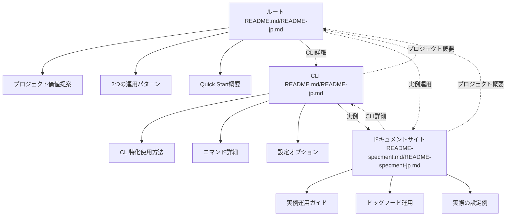
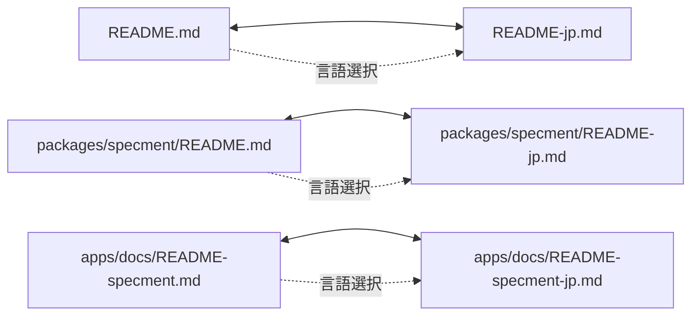

# デザインドキュメント

## 概要

このデザインは、Specmentプロジェクトの6つのREADMEファイル（英語版3つ + 日本語版3つ）を改善・新規作成し、内容の重複を避けながら効率的な情報提供を実現するものです。各READMEファイルは特定の役割を持ち、適切なリンクによる誘導で統合的な情報体験を提供します。

## アーキテクチャ

### 情報アーキテクチャ



### 多言語対応アーキテクチャ



## コンポーネントと インターフェース

### 1. ルートREADMEコンポーネント

#### 英語版: `README.md`
**役割**: プロジェクト全体のエントリーポイント

**構造**:
```markdown
# Specment
[言語選択リンク]

## About Specment
- ツールの目的と価値提案
- 解決する問題
- 主要機能の概要

## Usage Patterns
- Standalone Project運用
- Monorepo Integration運用
- 比較表

## Quick Start
- 基本的なセットアップ手順
- CLI詳細への参照リンク
- 実例への参照リンク

## Project Structure
[既存内容を保持・調整]

## Development
[既存内容を保持・統合]

## Contributing
[既存内容を保持]
```

#### 日本語版: `README-jp.md`
**役割**: 日本語話者向けのプロジェクト全体情報

**構造**: 英語版と同等の構造で日本語化

### 2. CLIツールREADMEコンポーネント

#### 英語版: `packages/specment/README.md`
**役割**: CLI特化の詳細情報

**構造**:
```markdown
# @plenarc/specment
[言語選択リンク] [プロジェクト概要への参照]

## Installation
- 詳細なインストール手順
- 環境要件

## Usage
- 基本コマンド（既存を拡張）
- 高度な使用例（新規）
- 実例への参照リンク

## Templates
[既存内容を拡張]

## Configuration
[既存内容を詳細化]

## Development
[ルートREADMEへの参照]
```

#### 日本語版: `packages/specment/README-jp.md`
**構造**: 英語版と同等の構造で日本語化

### 3. ドキュメントサイトREADMEコンポーネント

#### 英語版: `apps/docs/README-specment.md`
**役割**: 実例運用ガイド（既存内容を基盤として改善）

**構造**:
```markdown
# Specment Dogfooding Guide
[言語選択リンク] [プロジェクト概要への参照] [CLI詳細への参照]

## Overview
[既存内容を保持・改善]

## Setup
[既存内容を保持]

## Available Templates
[既存内容を保持]

## Usage
[既存内容を保持]

## Configuration File
[既存内容を保持]

## Best Practices
[既存内容を保持]

## Troubleshooting
[既存内容を保持]
```

#### 日本語版: `apps/docs/README-specment-jp.md`
**構造**: 英語版と同等の構造で日本語化

## データモデル

### READMEファイル構造モデル

```typescript
interface ReadmeFile {
  path: string;
  language: 'en' | 'jp';
  role: 'root' | 'cli' | 'docs';
  sections: Section[];
  crossReferences: CrossReference[];
}

interface Section {
  title: string;
  content: string;
  type: 'value-proposition' | 'usage-pattern' | 'quick-start' | 'technical' | 'reference';
  priority: 'high' | 'medium' | 'low';
}

interface CrossReference {
  targetFile: string;
  linkText: string;
  context: string;
  purpose: 'detail' | 'overview' | 'example';
}
```

### 内容重複回避モデル

```typescript
interface ContentStrategy {
  topic: string;
  rootLevel: 'overview' | 'none';
  cliLevel: 'detailed' | 'reference' | 'none';
  docsLevel: 'example' | 'reference' | 'none';
  crossReferences: string[];
}

// 例: インストール方法
const installationStrategy: ContentStrategy = {
  topic: 'installation',
  rootLevel: 'overview',     // 基本的な手順
  cliLevel: 'detailed',      // 詳細な手順と環境要件
  docsLevel: 'example',      // 実際のプロジェクトでの例
  crossReferences: ['root->cli', 'cli->docs']
};
```

## エラーハンドリング

### リンク切れ対策
- 相対パスを使用してファイル移動に対応
- 定期的なリンクチェック機能の提案
- 代替リンクの提供

### 多言語同期エラー対策
- 英語版更新時の日本語版更新チェックリスト
- 構造の一貫性チェック
- 翻訳漏れの検出方法

### 内容重複検出
- 同一内容の検出アルゴリズム
- 重複箇所の自動報告
- リファクタリング提案

## テスト戦略

### 構造テスト
1. **リンク整合性テスト**
   - 全ての内部リンクが有効であることを確認
   - 相互参照の循環参照チェック

2. **多言語対応テスト**
   - 英語版と日本語版の構造一致確認
   - セクション数と順序の一致確認

3. **内容重複テスト**
   - 同一内容の重複検出
   - 適切な参照関係の確認

### ユーザビリティテスト
1. **新規ユーザー体験テスト**
   - ルートREADMEからの情報取得フロー
   - 価値提案の理解度測定

2. **開発者体験テスト**
   - CLI使用方法の理解度
   - 実例運用ガイドの実用性

3. **多言語ユーザー体験テスト**
   - 言語選択の分かりやすさ
   - 日本語版の情報完全性

### 保守性テスト
1. **更新容易性テスト**
   - 単一ファイル更新時の影響範囲
   - 参照関係の維持確認

2. **一貫性維持テスト**
   - 複数ファイル間の情報一貫性
   - バージョン情報の同期確認

## 実装上の考慮事項

### ファイル配置戦略
- 各階層での適切なファイル名
- GitHubでの表示優先度考慮
- 検索エンジン最適化

### リンク戦略
- 相対パス vs 絶対パス
- GitHub Pages対応
- モバイル表示対応

### 保守戦略
- 定期的な内容見直しプロセス
- 多言語同期のワークフロー
- コミュニティからのフィードバック収集

### パフォーマンス考慮
- ファイルサイズの最適化
- 画像の適切な配置
- 読み込み速度の最適化

## 設計決定の根拠

### なぜ6つのファイルが必要か
1. **階層別の情報提供**: 各階層で異なるコンテキストの情報が必要
2. **多言語対応**: 日本語話者への配慮
3. **重複回避**: 適切な役割分担による効率的な情報提供

### なぜリンクによる誘導か
1. **保守性**: 単一の情報源による一貫性維持
2. **ユーザビリティ**: 必要な情報への効率的なアクセス
3. **拡張性**: 将来的な情報追加への対応

### なぜ既存構造を保持するか
1. **後方互換性**: 既存ユーザーへの配慮
2. **段階的改善**: リスクを最小化した改善アプローチ
3. **開発効率**: 既存の価値ある情報の活用