# 設計ドキュメント

## 概要

メインブランチへのプルリクエストマージ時に自動的にnpmパッケージを公開するGitHub Actionsワークフローの設計です。既存のChangesetsワークフローと統合し、セキュアで信頼性の高い自動リリースプロセスを実現します。また、関連ドキュメントの更新も含めて、完全な自動化ソリューションを提供します。

## アーキテクチャ

### システム全体アーキテクチャ


### ワークフロー統合アーキテクチャ


## コンポーネントとインターフェース

### 1. GitHub Actionsワークフローファイル

#### ファイル: `.github/workflows/npm-publish.yaml`

**役割**: メインブランチマージ時の自動npm公開を実行

**構造**:

```yaml
name: NPM Publish
on:
  push:
    branches: [main]
jobs:
  publish:
    runs-on: ubuntu-latest
    steps:
      - name: Checkout
      - name: Setup Node.js
      - name: Install dependencies
      - name: Build
      - name: Test
      - name: Check for changesets
      - name: Version and publish
      - name: Create git tags
```

**入力**:
- GitHub push イベント (main ブランチ)
- NPM_TOKEN (GitHub Secrets)
- Changesets ファイル

**出力**:
- npm パッケージ公開
- Git タグ作成
- ワークフロー実行ログ

### 2. Changesets統合コンポーネント

#### 既存Changesets設定の活用

**ファイル**: `.changeset/config.json`

**役割**: バージョン管理とリリースノート生成の設定

**統合ポイント**:
- バージョン決定ロジック
- パッケージ依存関係の管理
- リリースノート自動生成

### 3. セキュリティ管理コンポーネント

#### GitHub Secrets管理

**必要なSecrets**:
- `NPM_TOKEN`: npm公開用の認証トークン
- 権限: 公開パッケージへの書き込み権限

**セキュリティ対策**:
- 最小権限の原則
- トークンの定期的な更新
- 失敗時の適切なエラーハンドリング

### 4. ドキュメント更新コンポーネント

#### 更新対象ファイル

**CHANGESET_WORKFLOW.md**:
- 自動化されたワークフローの説明
- 手動プロセスとの比較
- トラブルシューティング

**RELEASE_PROCESS.md**:
- 新しいリリースプロセスの説明
- 緊急時の手動リリース手順
- ベストプラクティス

## データモデル

### ワークフロー実行データ

```typescript
interface WorkflowExecution {
  id: string;
  trigger: 'push' | 'manual';
  branch: string;
  commit: string;
  timestamp: Date;
  status: 'running' | 'success' | 'failure' | 'skipped';
  steps: WorkflowStep[];
}

interface WorkflowStep {
  name: string;
  status: 'pending' | 'running' | 'success' | 'failure' | 'skipped';
  startTime: Date;
  endTime?: Date;
  logs: string[];
  error?: string;
}
```

### パッケージ公開データ

```typescript
interface PackagePublication {
  packageName: string;
  version: string;
  previousVersion: string;
  changesets: string[];
  publishTime: Date;
  npmUrl: string;
  gitTag: string;
  releaseNotes: string;
}
```

### Changesets統合データ

```typescript
interface ChangesetData {
  id: string;
  summary: string;
  releases: Release[];
  timestamp: Date;
}

interface Release {
  name: string;
  type: 'major' | 'minor' | 'patch';
}
```

## エラーハンドリング

### エラー分類と対応

#### 1. ビルド/テストエラー
**原因**: コードの品質問題
**対応**: 
- ワークフローを即座に停止
- 詳細なエラーログを出力
- 開発者への通知

#### 2. 認証エラー
**原因**: NPM_TOKENの問題
**対応**:
- セキュアなエラーメッセージ（トークン情報を含まない）
- 管理者への通知
- 手動リリース手順の案内

#### 3. npm公開エラー
**原因**: ネットワーク問題、パッケージ競合など
**対応**:
- リトライ機能（最大3回）
- 詳細なエラー情報の記録
- 手動リリースへのフォールバック案内

#### 4. Changesets不整合エラー
**原因**: Changesets設定の問題
**対応**:
- 設定検証の実行
- 修正手順の案内
- ワークフローのスキップ

### エラー通知システム

```mermaid
graph TD
    A[エラー発生] --> B{エラー種別}
    B -->|ビルド/テスト| C[開発者通知]
    B -->|認証| D[管理者通知]
    B -->|npm公開| E[リトライ実行]
    B -->|Changesets| F[設定確認案内]
    
    E --> G{リトライ成功?}
    G -->|失敗| H[手動リリース案内]
    G -->|成功| I[正常完了]
```



## テスト戦略

### 1. ワークフロー単体テスト

**テスト対象**:
- 各ステップの実行ロジック
- エラーハンドリング
- 条件分岐

**テスト方法**:
- GitHub Actions のローカルテスト（act）
- モックデータを使用した実行
- 各種エラーシナリオの検証

### 2. 統合テスト

**テスト対象**:
- Changesets との統合
- npm公開プロセス
- Git タグ作成

**テスト方法**:
- テスト用リポジトリでの実行
- npm test レジストリの使用
- 実際のマージシナリオの再現

### 3. セキュリティテスト

**テスト対象**:
- 認証情報の適切な管理
- ログでの機密情報漏洩防止
- 権限の最小化

**テスト方法**:
- セキュリティスキャンツールの使用
- ログ出力の検証
- 権限設定の監査

### 4. ドキュメント品質テスト

**テスト対象**:
- ドキュメントの正確性
- 手順の実行可能性
- 情報の最新性

**テスト方法**:
- ドキュメント通りの手順実行
- リンク切れチェック
- 内容の一貫性確認

## 実装上の考慮事項

### パフォーマンス最適化

1. **並列実行**: 可能な限りステップを並列化
2. **キャッシュ活用**: 依存関係とビルド成果物のキャッシュ
3. **条件実行**: 不要なステップのスキップ

### 保守性の確保

1. **モジュール化**: 再利用可能なアクションの作成
2. **設定の外部化**: 環境変数での設定管理
3. **ログの標準化**: 一貫したログフォーマット

### 拡張性の考慮

1. **複数パッケージ対応**: monorepo での複数パッケージ公開
2. **カスタムフック**: 公開前後の処理追加
3. **通知システム**: Slack、Discord等への通知

### セキュリティ強化

1. **最小権限**: 必要最小限の権限設定
2. **監査ログ**: 全ての操作の記録
3. **定期的な見直し**: セキュリティ設定の定期確認

## 設計決定の根拠

### なぜGitHub Actionsを選択するか

1. **統合性**: GitHubとの完全な統合
2. **無料枠**: オープンソースプロジェクトでの無料利用
3. **豊富なエコシステム**: 既存アクションの活用
4. **セキュリティ**: GitHub Secretsの安全な管理

### なぜChangesetsとの統合か

1. **既存ワークフロー**: プロジェクトで既に使用中
2. **セマンティックバージョニング**: 適切なバージョン管理
3. **リリースノート**: 自動生成機能
4. **monorepo対応**: 複数パッケージの管理

### なぜドキュメント更新を含めるか

1. **一貫性**: プロセス変更の完全な反映
2. **保守性**: 将来の開発者への配慮
3. **透明性**: プロセスの可視化
4. **品質**: ドキュメント駆動開発の実践

## 実装フェーズ

### フェーズ1: 基本ワークフロー
- GitHub Actionsファイルの作成
- 基本的なnpm公開機能
- エラーハンドリングの実装

### フェーズ2: Changesets統合
- Changesets検出ロジック
- バージョン管理の自動化
- リリースノート生成

### フェーズ3: セキュリティ強化
- 認証情報の適切な管理
- エラー時の情報漏洩防止
- 権限の最小化

### フェーズ4: ドキュメント更新
- CHANGESET_WORKFLOW.mdの更新
- RELEASE_PROCESS.mdの更新
- トラブルシューティング情報の追加

### フェーズ5: テストと最適化
- 包括的なテストの実装
- パフォーマンス最適化
- 最終的な品質確認