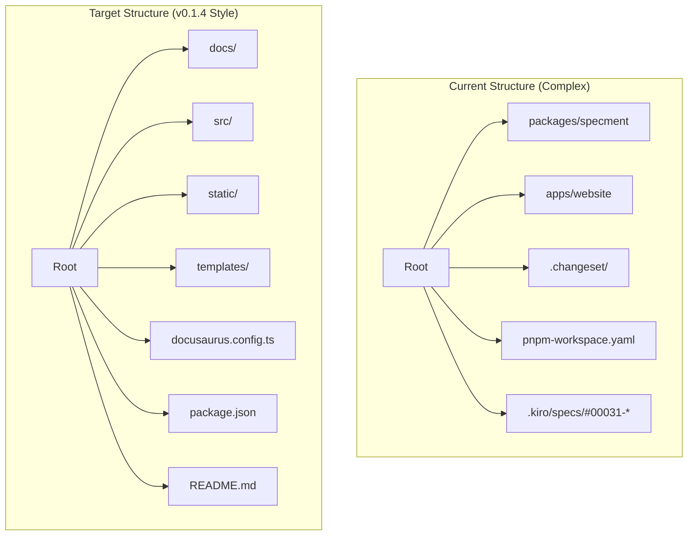
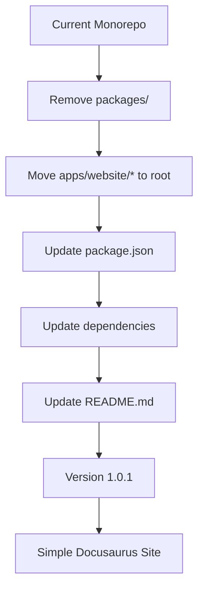

# Design Document: Return Specment to Simple Structure

## Overview

Specmentリポジトリを現在の複雑なモノレポ構造からv0.1.4時点のシンプルなDocusaurusベースのドキュメントサイト構造に戻す。この変更により、リポジトリはサンプルリポジトリとしての役割を明確にし、create-specmentツールで生成されるサイトの例として機能する。

### 設計原則

1. **シンプルさの復元**: v0.1.4のシンプルな構造に戻す
2. **コンテンツの保持**: 既存のドキュメントコンテンツを失わない
3. **最新化**: npm依存関係を最新バージョンに更新
4. **明確な役割**: サンプルリポジトリとしての位置づけを明確化
5. **create-specmentとの連携**: 生成結果の例として機能

## Architecture

### 現在の構造 vs 目標構造



### 変更フロー



## Components and Interfaces

### 1. フォルダ構造変更システム

**責任**: モノレポ構造からシンプル構造への変換

**変更内容**:
- `packages/` ディレクトリを削除
- `apps/website/` の内容をルートに移動
- `pnpm-workspace.yaml` を削除
- `.changeset/` ディレクトリを削除
- モノレポ関連設定ファイルを削除
```

### 2. 依存関係更新システム

**責任**: npm依存関係の最新バージョンへの更新

**更新対象**:
- Docusaurus関連パッケージを最新版に更新
- TypeScript関連パッケージを最新版に更新
- 開発依存関係を最新版に更新
- package.jsonのバージョンを1.0.1に更新
- 互換性を保ちながら更新
```

### 3. コンテンツ移行システム

**責任**: 既存コンテンツの保持と移動

**移行対象**:
- `apps/website/docs/` → `docs/` に移動
- `apps/website/src/` → `src/` に移動  
- `apps/website/static/` → `static/` に移動
- `apps/website/templates/` → `templates/` に移動（後で整理予定）
- すべてのファイル内容を保持
- 内部リンクの更新
```

## Data Models

### 変更対象ファイル

**削除するファイル・ディレクトリ**:
- `packages/` ディレクトリ全体
- `apps/` ディレクトリ（移動後）
- `.changeset/` ディレクトリ
- `pnpm-workspace.yaml`
- `.kiro/specs/#00031-specment-interactive-setup/`

**移動するファイル・ディレクトリ**:
- `apps/website/docs/` → `docs/`
- `apps/website/src/` → `src/`
- `apps/website/static/` → `static/`
- `apps/website/templates/` → `templates/`
- `apps/website/docusaurus.config.ts` → `docusaurus.config.ts`
- `apps/website/package.json` → `package.json`（内容更新）

**更新するファイル**:
- `package.json`: バージョン1.0.1、依存関係更新、スクリプト簡素化
- `README.md`: サンプルリポジトリとしての説明に変更
```

### README.md構造

**新しいREADME.mdの内容**:
- サンプルリポジトリであることを明記
- create-specmentへの誘導（https://github.com/plenarc/create-specment）
- create-specmentで作った結果がこのサイトになることを説明
- カスタマイズ方法はDocusaurus公式ドキュメント参照
- フォークに関する説明は削除
```

## 正確性プロパティ

*プロパティとは、システムのすべての有効な実行において真であるべき特性や動作のことです。仕様と機械検証可能な正確性保証の橋渡しをする正式な記述です。*

### Property 1: 構造変更の完全性
*任意の* モノレポ構造から単一Docusaurusプロジェクト構造への変換において、すべての必要なファイルが適切な場所に配置されるべきである
**検証対象: Requirements 1.2, 1.3**

### Property 2: コンテンツ保持の一貫性
*任意の* ドキュメントファイルに対して、移行前後でファイル内容が保持されるべきである
**検証対象: Requirements 5.5**

### Property 3: 依存関係更新の正確性
*任意の* npm依存関係に対して、更新後のバージョンが最新の安定版であるべきである
**検証対象: Requirements 2.1, 2.4**

### Property 4: 設定ファイルの簡素化
*任意の* package.jsonスクリプトに対して、モノレポ関連スクリプトが存在せず、標準Docusaurusスクリプトのみが存在するべきである
**検証対象: Requirements 4.1, 4.2**

### Property 5: 不要ファイルの完全削除
*任意の* モノレポ関連ファイルに対して、変換後にそのファイルが存在しないべきである
**検証対象: Requirements 6.2, 6.3, 6.4**

### Property 6: Docusaurusコマンドの動作保証
*任意の* 標準Docusaurusコマンド（install, start, build）に対して、エラーなく実行完了するべきである
**検証対象: Requirements 8.1, 8.2, 8.3**

### Property 7: ページ表示の正常性
*任意の* ドキュメントページに対して、ビルド後に正常に表示されるべきである
**検証対象: Requirements 8.4, 8.5**

### Property 8: テンプレート互換性の維持
*任意の* 既存テンプレートファイルに対して、変換後も同じ機能を提供するべきである
**検証対象: Requirements 9.4**

## エラーハンドリング

### ファイル操作エラー

1. **ファイル移動失敗**: 権限不足やファイルロック時の処理
2. **ディレクトリ削除失敗**: 使用中ファイルがある場合の処理
3. **コンテンツ破損**: ファイル移動時の整合性チェック

### 依存関係更新エラー

1. **バージョン競合**: 互換性のないバージョン組み合わせの処理
2. **ネットワークエラー**: パッケージダウンロード失敗時の処理
3. **インストール失敗**: 依存関係解決失敗時の処理

### 設定ファイルエラー

1. **JSON構文エラー**: package.json更新時の構文チェック
2. **設定不整合**: Docusaurus設定の妥当性チェック
3. **TypeScript設定エラー**: tsconfig.json更新時の検証

## テスト戦略

### 単体テスト
- ファイル移動機能のテスト
- 依存関係更新ロジックのテスト
- 設定ファイル生成のテスト
- README.md内容生成のテスト

### 統合テスト
- 完全な構造変換のエンドツーエンドテスト
- Docusaurusコマンド実行テスト
- ビルド成果物の検証テスト
- ページ表示確認テスト

### プロパティベーステスト
- 最小100回の反復実行
- 各プロパティテストは対応する設計プロパティを参照
- タグ形式: **Feature: return-specment-to-simple-structure, Property {number}: {property_text}**

### 手動テスト
- README.mdの内容確認
- サンプルリポジトリとしての機能確認
- create-specmentとの関係説明の妥当性確認

## 実装フェーズ

### Phase 1: 準備と検証
1. 現在の構造の分析
2. 移行対象ファイルの特定
3. バックアップの作成

### Phase 2: 構造変更
1. 不要ディレクトリの削除
2. ファイルの移動
3. 設定ファイルの更新

### Phase 3: 依存関係更新
1. package.jsonの更新
2. 依存関係の最新化
3. バージョン1.0.1への更新

### Phase 4: ドキュメント更新
1. README.mdの書き換え
2. サンプルリポジトリとしての説明追加
3. create-specmentとの関係説明

### Phase 5: 検証とテスト
1. 全コマンドの動作確認
2. ページ表示の確認
3. 統合テストの実行

## 成功基準

1. **構造の簡素化**: v0.1.4スタイルのシンプルな構造
2. **コンテンツの保持**: すべてのドキュメントコンテンツが保持される
3. **動作の正常性**: 標準Docusaurusコマンドが正常動作
4. **明確な役割**: サンプルリポジトリとしての位置づけが明確
5. **最新化の完了**: すべての依存関係が最新バージョン
6. **バージョン更新**: package.jsonが1.0.1に更新される

## リスク管理

### 高リスク
- **コンテンツ損失**: ファイル移動時のデータ損失
- **依存関係破綻**: 互換性のないバージョン更新

### 中リスク
- **設定不整合**: Docusaurus設定の不備
- **リンク切れ**: 内部リンクの更新漏れ

### 低リスク
- **README.md内容**: 説明文の不備
- **バージョン表記**: バージョン番号の不整合

### 対策
1. **段階的実行**: フェーズごとの検証
2. **バックアップ**: 変更前の完全バックアップ
3. **自動テスト**: プロパティベーステストによる検証
4. **手動確認**: 重要な変更の目視確認