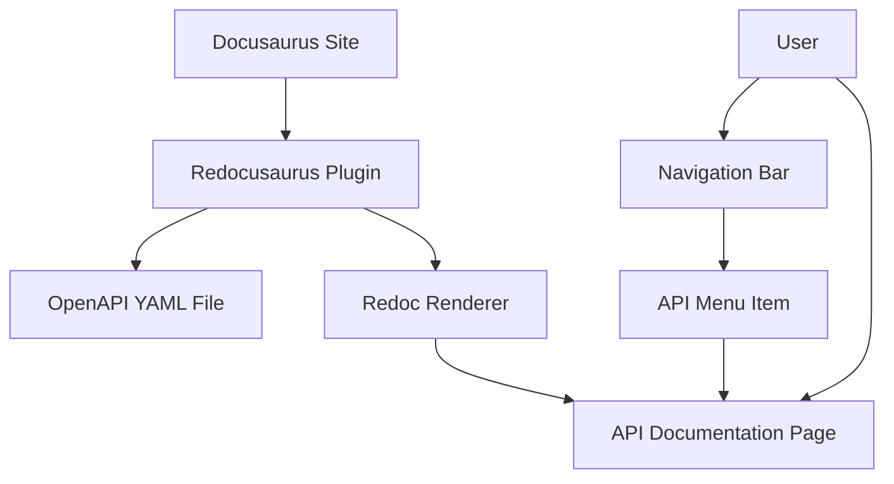

# Design Document

## Issue Reference
GitHub Issue: #33 - Adding Redocusaurus

## Overview

RedocusaurusプラグインをDocusaurusサイトに統合し、OpenAPI仕様書を美しく表示する機能を実装します。既存のナビゲーション構造に「API」メニューを追加し、`/api/`パスでアクセス可能なAPI仕様書ページを提供します。

## Architecture

### システム構成



### 技術スタック

- **Redocusaurus**: RedocでOpenAPI仕様書を表示するDocusaurusプラグイン
- **OpenAPI 3.0**: API仕様書フォーマット
- **TypeScript**: 設定とタイプセーフティ
- **React**: コンポーネントレンダリング（Docusaurus経由）

## Components and Interfaces

### 1. Redocusaurus Plugin Configuration

**責任**: OpenAPI仕様書の読み込みとRedocレンダリングの設定

**インターフェース**:
```typescript
interface RedocusaurusConfig {
  specs: Array<{
    spec: string;           // OpenAPI YAML file path
    id: string;            // Unique identifier
    route: string;         // URL route path
  }>;
  theme?: {
    primaryColor?: string; // Theme customization
  };
}
```

### 2. Navigation Integration

**責任**: ナビゲーションバーへのAPIメニュー項目の追加

**インターフェース**:
```typescript
interface NavbarItem {
  label: string;
  position: 'left' | 'right';
  to: string;
}
```

### 3. OpenAPI Specification Handler

**責任**: OpenAPI YAML ファイルの管理と検証

**要件**:
- OpenAPI 3.0形式のサポート
- YAML形式のファイル読み込み
- 基本的な構文検証

## Data Models

### OpenAPI Specification Structure

```yaml
openapi: 3.0.0
info:
  title: API Title
  version: 1.0.0
  description: API Description
paths:
  /endpoint:
    get:
      summary: Endpoint summary
      responses:
        '200':
          description: Success response
components:
  schemas:
    # Data models
```

### Configuration Model

```typescript
interface DocusaurusConfig {
  presets: Array<[string, any]>;
  themeConfig: {
    navbar: {
      items: NavbarItem[];
    };
  };
}
```

## Correctness Properties

*プロパティとは、システムの全ての有効な実行において真であるべき特性や動作のことです。つまり、システムが何をすべきかについての形式的な記述です。プロパティは、人間が読める仕様と機械で検証可能な正確性保証の橋渡しをします。*

### Property 1: OpenAPI表示
*任意の* 有効なOpenAPI YAMLファイルに対して、システムはRedocusaurusを使用してAPI仕様書ページとして表示する
**検証対象: Requirements 1.1, 1.2**

### Property 2: ナビゲーション統合
*任意の* ユーザーがAPIメニュー項目をクリックした時、システムは`/api/`ルートに遷移してAPI仕様書を表示する
**検証対象: Requirements 2.1, 2.2, 2.3, 2.4**

### Property 3: プラグイン設定
*任意の* ビルド時、Redocusaurusプラグインが正しく設定され、エラーなくコンパイルされる
**検証対象: Requirements 3.1, 3.2, 3.3**

## Error Handling

エラーハンドリングはRedocusaurus/Redocの標準機能に委ねます。プラグインが適切に設定されていれば、無効なOpenAPIファイルや設定エラーは自動的に処理されます。

## Testing Strategy

### Unit Tests
- Redocusaurusプラグインの設定確認
- ナビゲーション項目の存在確認
- 基本的なビルド成功確認

### Integration Tests
- 完全なビルドプロセスの実行
- 開発サーバーでの動作確認
- ナビゲーションからAPIページへのアクセス

### Test Configuration
- Testing library: Jest (TypeScript環境)
- テストタグ形式: **Feature: api-documentation-display, Property {number}: {property_text}**
