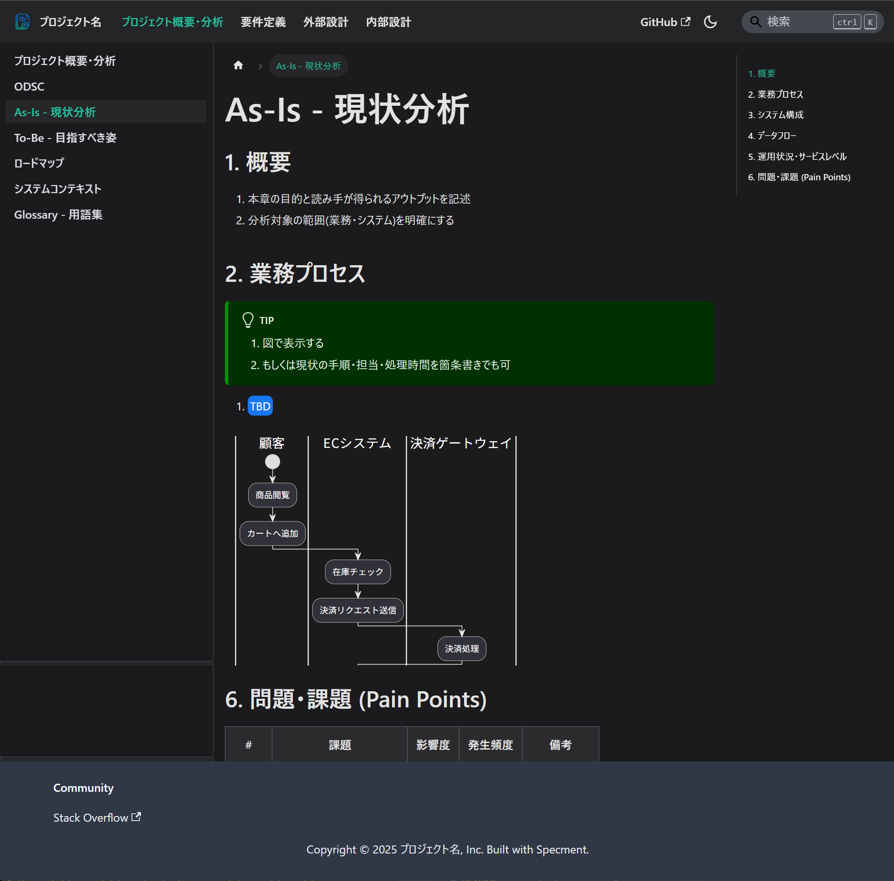

# Specment サンプルリポジトリ

[](LICENSE)

[English](README.md) | [日本語](README-jp.md)

Demo: https://plenarc.github.io/specment/

'specification' + 'document' => Specment

<div align="center">
  <table>
    <tr>
      <td align="center">
        
        <br>
        <em>生成されたドキュメントサイトのトップビュー</em>
      </td>
      <td align="center">
        
        <br>
        <em>例: プロジェクト概要</em>
      </td>
      <td align="center">
        
        <br>
        <em>例: As-Is 現状分析</em>
      </td>
    </tr>
  </table>
</div>

## このリポジトリについて

**これはサンプルリポジトリです**。完全にセットアップされたSpecmentドキュメントサイトがどのようなものかを示しています。このリポジトリは、[create-specment](https://github.com/plenarc/create-specment)ツールを使用したときに作成されるドキュメントサイトの実例として機能します。

### Specmentとは？

Specmentは**markdown(MDX)で仕様サイトを作成し、Gitで仕様を管理する**ためのリポジトリベースのソリューションです。ソフトウェアプロジェクトにおける一貫性のないドキュメント慣行や散在する仕様ファイルの一般的な問題を解決します。

### Specmentが解決する問題

1. **一貫性のないドキュメント**: チームは多くの場合、プロジェクト間で異なるドキュメント形式や構造に悩まされています
1. **テンプレート管理**: 一貫したドキュメントテンプレートの作成と維持には時間がかかります
1. **ドキュメント生成**: 仕様を読みやすいドキュメントサイトに変換するには手動作業が必要です
1. **検証と品質**: ドキュメントが標準や規約に従っているかを確認することは困難です

### 主な機能

1. **Markdown/MDXサポート**: mdx(markdown)でで仕様を記述
1. **Docusaurus統合**: ドキュメントサイトの生成
1. **Gitワークフロー**: mdxにすることで仕様をGitrl管理
1. **テンプレートシステム**: 仕様作成時によく使うフォーマットをテンプレート(サンプル)として表示

## はじめに

Specmentでドキュメントサイトを作成するには公式のcreate-specmentツールをご利用ください：

### 🚀 [Specmentサイトを作成](https://github.com/plenarc/create-specment)

create-specmentツールは、このサンプルリポジトリと同様のドキュメントサイトを、あなたのプロジェクトのニーズに合わせてカスタマイズして生成します。

```bash
# 新しいSpecmentドキュメントサイトを作成
npx create-specment@latest my-spec-site
cd my-spec-site
npm start
```

結果として、このサンプルリポジトリのようなドキュメントサイトが作成され、独自の仕様やコンテンツでカスタマイズできるようになります。

## このサンプルリポジトリについて

このリポジトリでは以下のことを確認できます：

1. **ドキュメント構造**: Specmentサイトがどのように整理されているかを確認
1. **実際の例**: 実際の仕様ドキュメントとテンプレートを閲覧
1. **ライブデモ**: https://plenarc.github.io/specment/ で生成されたドキュメントサイトを体験
1. **ベストプラクティス**: この例を元に必要な仕様の確認
1. **ソースを確認**: `docs/`フォルダーで仕様がどのように構造化されているか
1. **設定を理解**: 仕様サイト用のDocusaurusの設定方法

## カスタマイズ

1. **カスタマイズ方法**: すべてDocusaurusの機能で実現しているため、カスタマイズオプションについては[公式Docusaurusドキュメント](https://docusaurus.io/docs)を参照
1. **テーマ設定**: ビジュアルカスタマイズについては[Docusaurusテーマ設定](https://docusaurus.io/docs/styling-layout)を学習
1. **Config設定**: 高度なセットアップについては[Docusaurus設定ガイド](https://docusaurus.io/docs/configuration)を確認
1. **プラグイン**: 機能拡張のために[Docusaurusプラグイン](https://docusaurus.io/docs/using-plugins)

## ライセンス

MIT
