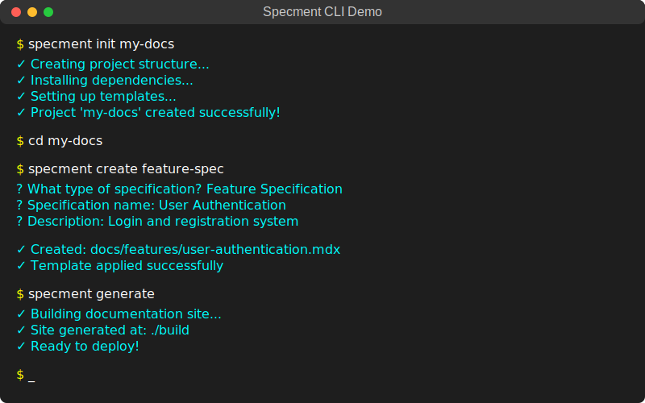
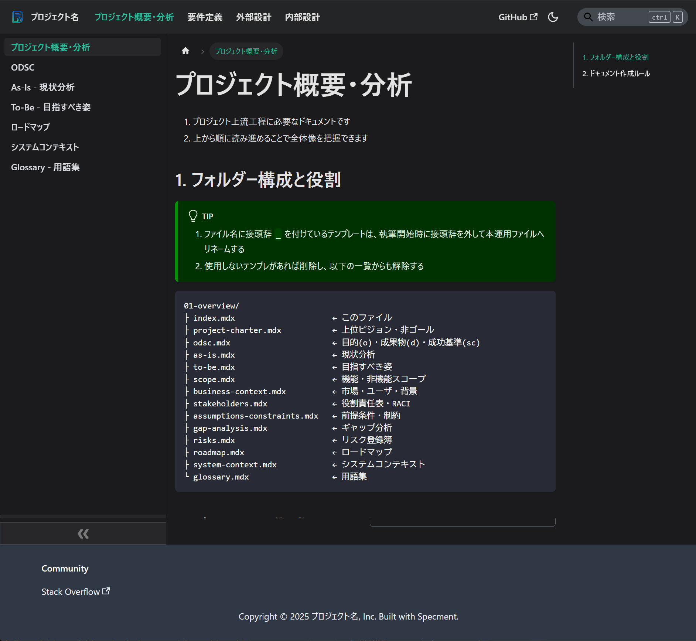

<div align="center">


# Specment

[](https://www.npmjs.com/package/@plenarc/specment)
[](LICENSE)

[English](README.md) | [日本語](README-jp.md)

https://plenarc.github.io/specment/

'specification' + 'document' => Specment

</div>

## Specmentについて

Specmentは**markdown(mdx)で仕様サイトを作り、仕様をgit管理する**ためのリポジトリベースのソリューションです。ソフトウェアプロジェクトでよくある、一貫性のないドキュメント作成手法や散在する仕様ファイルの問題を解消します

### Specmentが解決する問題

1. **一貫性のないドキュメント**: チームは多くの場合、プロジェクト間で異なるドキュメント形式や構造に悩まされています
1. **テンプレート管理**: 一貫したドキュメントテンプレートの作成と維持には時間がかかります
1. **ドキュメント生成**: 仕様書を読みやすいドキュメントサイトに変換するには手作業が必要です
1. **検証と品質**: ドキュメントが標準や規約に従っているかを確認することは困難です

### 基本コンセプト

Specmentは2つの基本原則に従います：

1. **markdown(MDX)で仕様サイトを作成** - 仕様書をプロフェッショナルなウェブサイトに変換
1. **Gitで仕様を管理** - 完全なバージョン管理、ブランチ、コラボレーションワークフロー

### 主要機能

1. **リポジトリベースアーキテクチャ**: このリポジトリが仕様書プロジェクトの基盤として機能
1. **Markdown/MDXサポート**: 馴染みのあるmarkdownとReactコンポーネントサポートで仕様書を作成
1. **Docusaurus統合**: プロフェッショナルなドキュメントサイトの自動生成
1. **Gitワークフロー**: ブランチ、マージ、コラボレーション機能を含む完全なバージョン管理
1. **テンプレートシステム**: 一般的な仕様書タイプ用の事前構築されたテンプレートと構造
1. **開発ツール**: 仕様書開発ワークフローをサポートするCLIユーティリティ

<div align="center">



*仕様書開発と検証のためのCLIツール*

</div>

## 使用パターン

Specmentは、異なるプロジェクトのニーズに合わせて2つの主要な使用パターンをサポートしています

<div align="center">


*2つの主要な使用パターン: 単独プロジェクト運用 vs Monorepo統合*

</div>

### 単独プロジェクト運用

このリポジトリを専用の仕様書ウェブサイトプロジェクトの基盤として使用します。

**メリット:**
1. ドキュメントとソースコードの明確な分離
1. 仕様書での共有と共同作業が簡単
1. ドキュメント中心のプロジェクトでの軽量なセットアップ
1. 独立したバージョン管理とリリースサイクル

**適用場面:**
1. APIドキュメントプロジェクト
1. 製品仕様書リポジトリ
1. チーム横断のドキュメント取り組み
1. 外部向けドキュメントサイト

### Monorepo統合

既存のmonorepoワークフローに仕様書管理を直接統合する場合に理想的です

**メリット:**
1. 仕様書が説明対象のコードと同じ場所に存在
1. 統一された開発ワークフロー
1. 共有されたツールと設定
1. コード変更と同期したバージョン管理

**適用場面:**
1. 複数のコンポーネントを持つ大規模アプリケーション
1. ドキュメントをコードの近くに置くことを好むチーム
1. 複雑な相互依存関係を持つプロジェクト
1. 継続的インテグレーションワークフロー

## 前準備

### 推奨ツール

> [!INFO]
> 推奨: mise
> GitHub: https://github.com/jdx/mise

### 必要なツール
1. Node.js (>=22.0)
   1. LTS推奨
   1. ```bash
      mise use node@lts
      ```

### 推奨のパッケージマネージャー
1. pnpm
   1. ```bash
      mise use pnpm@latest
      ```

## クイックスタート

使用パターンに応じて、以下のいずれかの手順に従ってください：

<div align="center">


*Specmentを始めるためのステップバイステップワークフロー*

</div>

### パターン1: 単独プロジェクト運用

専用のドキュメントプロジェクトを作成する場合：

```bash
# ドキュメントプロジェクトを作成したい場所に移動
cd ~/projects

# このリポジトリをクローンして専用の仕様書サイトを作成
git clone https://github.com/plenarc/specment.git my-spec-site
cd my-spec-site

# 依存関係をインストール
pnpm install

# ドキュメントサイトを起動して確認
pnpm docs:start
```

<div align="center">


*生成されるドキュメントサイトのトップビュー*

</div>

<div align="center">



*例: プロジェクト概要*

</div>

<div align="center">


*例: As-Is 現状分析*

</div>

**フォルダー構成:**

```
my-spec-site/
├── apps/
│ └── website/              # Specment - ドキュメントサイト
│   ├── docs/               # 仕様書ファイル(markdown/mdx)
│   ├── src/                # サイトカスタマイズ
│   └── docusaurus.config.ts
├── packages/
│ └── specment/             # CLI開発ツール
├── package.json            # ワークスペース設定
└── pnpm-workspace.yaml
```

### パターン2: Monorepo統合

既存のmonorepoプロジェクトに仕様書サイトを追加したい場合：

```bash
# 既存のmonorepoフォルダーに移動
cd ~/projects/my-existing-monorepo

# monorepoの適切な場所にSpecmentをクローン
#  turborepoなら apps/、
#  Nx なら apps/ または libs/、
#  独自構成なら packages/ など
git clone https://github.com/plenarc/specment.git apps/specment

# 依存関係をインストール
pnpm install

# ドキュメントサイトを起動
pnpm --filter specment docs:start
```

**統合後のフォルダー構成例:**

```
my-existing-monorepo/
├── apps/
│ ├── web/                  # 既存のWebアプリなど
│ ├── api/                  # 既存のAPIなど
│ └── specment/             # Specment - ドキュメントサイト
├── packages/
│ └── shared/               # 既存の共有パッケージ
└── package.json            # 既存のワークスペース設定
```

## 詳細情報

### CLI開発ツール

インストール、コマンド、設定、高度なCLI使用方法については：

**🔧 [CLIツールドキュメント](packages/specment/README-jp.md)** - 完全なCLIリファレンスと開発ツール

### 実際の実装例

このSpecmentプロジェクトは自身のドキュメントワークフローを通じて実用的な使用方法を実演しています：

**🔗 [ドッグフード運用ガイド](apps/website/README-specment-jp.md)** - 実際の使用パターンとベストプラクティス

### 完全なドキュメント

**🌐 [Specment公式サイト](https://plenarc.github.io/specment/)** - 包括的なガイド、チュートリアル、APIリファレンス

## ライセンス

MIT
