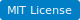
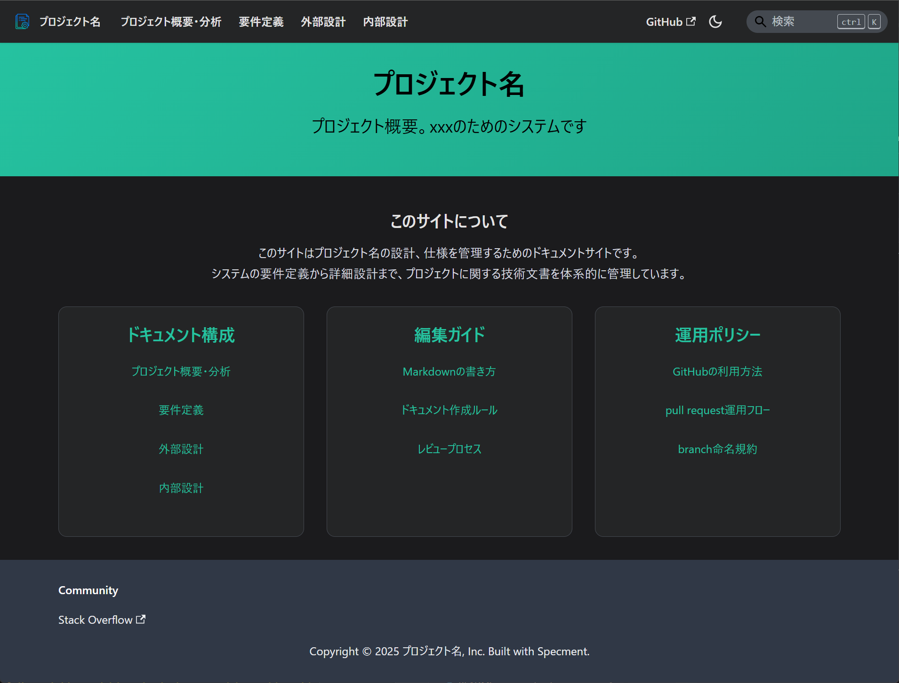
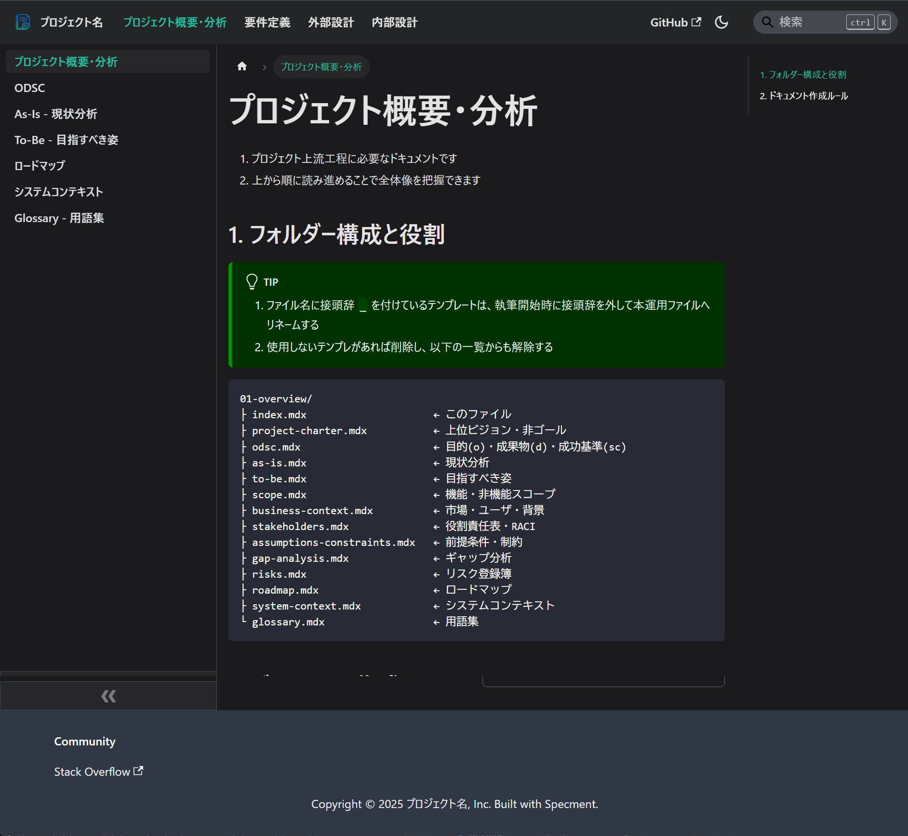
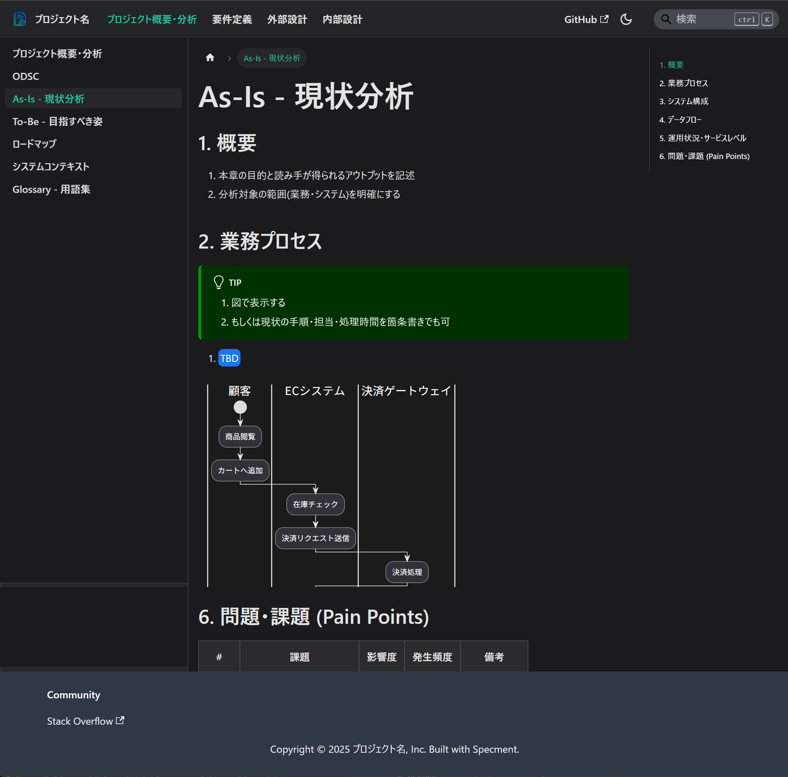

# Specment Sample Repository

[](LICENSE)

[English](README.md) | [日本語](README-jp.md)

Demo: https://plenarc.github.io/specment/

'specification' + 'document' => Specment

<div align="center">
  <table>
    <tr>
      <td align="center">
        
        <br>
        <em>Top view of the generated documentation site</em>
      </td>
      <td align="center">
        
        <br>
        <em>Example: Project Overview</em>
      </td>
      <td align="center">
        
        <br>
        <em>Example: As-Is Current State Analysis</em>
      </td>
    </tr>
  </table>
</div>

## About This Repository

**This is a sample repository** that demonstrates what a Specment documentation site looks like when fully set up. This repository serves as a live example of the documentation site that will be created when you use the [create-specment](https://github.com/plenarc/create-specment) tool.

### What is Specment?

Specment is a repository-based solution for **creating specification sites with markdown (MDX) and managing specifications with Git**. It solves common problems of inconsistent documentation practices and scattered specification files in software projects.

### What Problems Does Specment Solve?

1. **Inconsistent Documentation**: Teams often struggle with different documentation formats and structures across projects
1. **Template Management**: Creating and maintaining consistent document templates is time-consuming
1. **Documentation Generation**: Converting specifications into readable documentation sites requires manual effort
1. **Validation and Quality**: Ensuring documentation follows standards and conventions is difficult to enforce

### Key Features

1. **Markdown/MDX Support**: Write specifications in mdx (markdown) format
1. **Docusaurus Integration**: Generate documentation sites automatically
1. **Git Workflow**: Manage specifications with Git version control
1. **Template System**: Display commonly used formats as templates (samples) when creating specifications

## Getting Started

To create a documentation site with Specment, please use the official create-specment tool:

### 🚀 [Create Your Specment Site](https://github.com/plenarc/create-specment)

The create-specment tool will generate a documentation site similar to this sample repository, customized for your project needs.

```bash
# Create a new Specment documentation site
npx create-specment@latest my-spec-site
cd my-spec-site
npm start
```

The result will be a documentation site like this sample repository, ready for you to customize with your own specifications and content.

## About This Sample Repository

This repository allows you to:

1. **Document Structure**: See how a Specment site is organized
1. **Real Examples**: Browse actual specification documents and templates
1. **Live Demo**: Experience the generated documentation site at https://plenarc.github.io/specment/
1. **Best Practices**: Use this example to understand required specifications
1. **Source Review**: Check the `docs/` folder to see how specifications are structured
1. **Configuration Understanding**: Learn how to configure Docusaurus for specification sites

## Customization

1. **Customization Methods**: Everything is implemented using Docusaurus features, so refer to the [official Docusaurus documentation](https://docusaurus.io/docs) for customization options
1. **Theme Settings**: Learn about [Docusaurus theme configuration](https://docusaurus.io/docs/styling-layout) for visual customization
1. **Config Settings**: Check the [Docusaurus configuration guide](https://docusaurus.io/docs/configuration) for advanced setup
1. **Plugins**: Explore [Docusaurus plugins](https://docusaurus.io/docs/using-plugins) for feature extensions

## License

MIT
