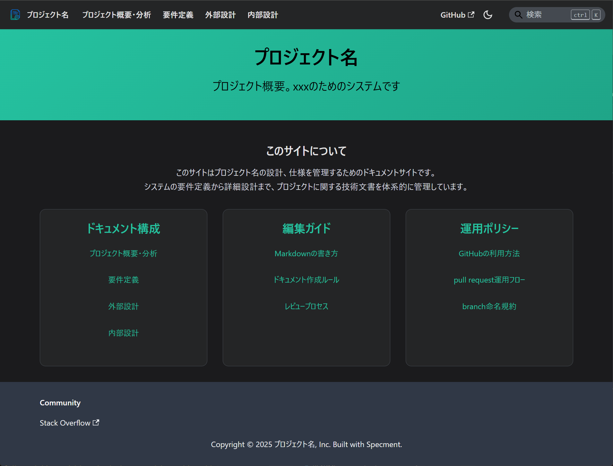
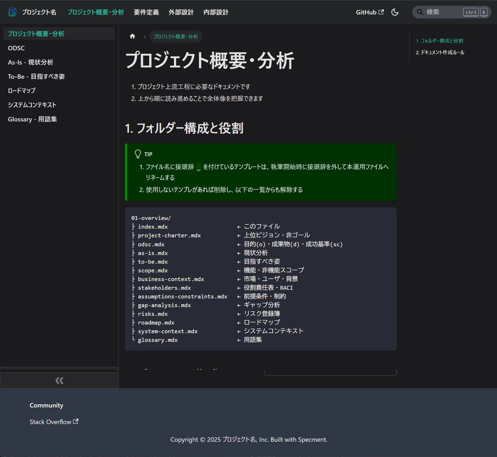
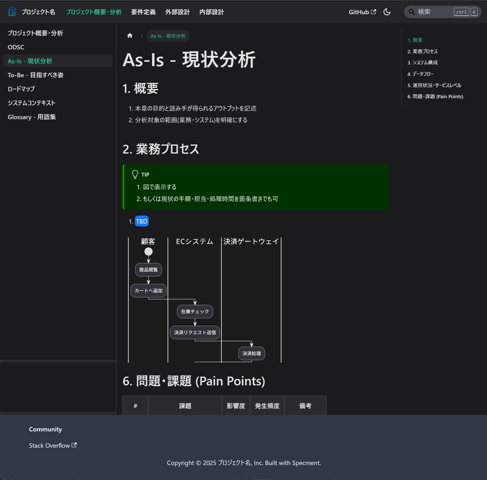
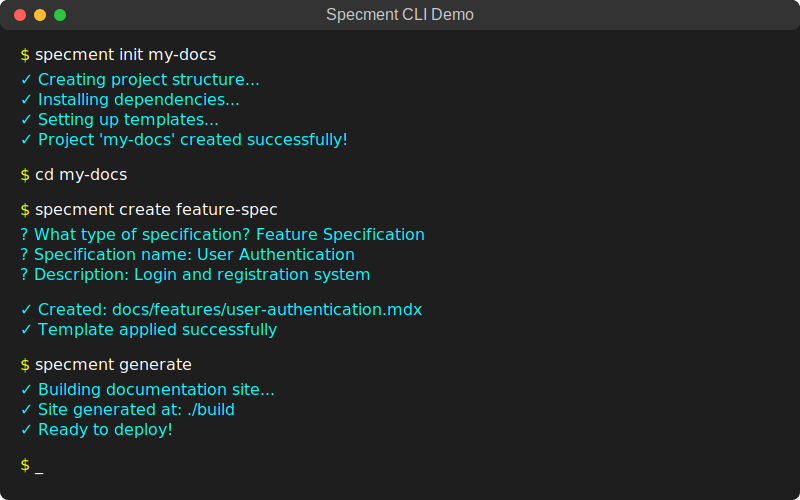
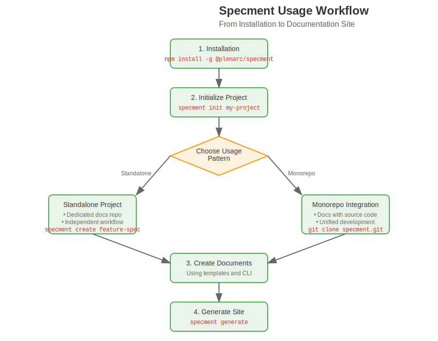

# Specment

[](https://www.npmjs.com/package/@plenarc/specment)
[](LICENSE)

[English](README.md) | [日本語](README-jp.md)

Demo: https://plenarc.github.io/specment/

'specification' + 'document' => Specment

</div>

<div align="center">
  <table>
    <tr>
      <td align="center">
        
        <br>
        <em>Top view of the generated documentation site</em>
      </td>
      <td align="center">
        
        <br>
        <em>Example: Project Overview</em>
      </td>
      <td align="center">
        
        <br>
        <em>Example: As-Is Current State Analysis</em>
      </td>
    </tr>
  </table>
</div>

## About Specment

Specment is a repository-based solution for **creating specification sites with markdown (MDX) and managing specifications with Git**. It solves common problems of inconsistent documentation practices and scattered specification files in software projects.

### What Problems Does Specment Solve?

1. **Inconsistent Documentation**: Teams often struggle with different documentation formats and structures across projects
1. **Template Management**: Creating and maintaining consistent document templates is time-consuming
1. **Documentation Generation**: Converting specifications into readable documentation sites requires manual effort
1. **Validation and Quality**: Ensuring documentation follows standards and conventions is difficult to enforce

### Core Concept

Specment follows two fundamental principles:

1. **Create specification sites with markdown (MDX)** - Transform your specifications into professional websites
1. **Manage specifications with Git** - Full version control, branching, and collaboration workflow

### Key Features

1. **Repository-Based Architecture**: This repository serves as the foundation for your specification projects
1. **Markdown/MDX Support**: Write specifications in familiar markdown with React component support
1. **Docusaurus Integration**: Automatic generation of professional documentation websites
1. **Git Workflow**: Full version control with branching, merging, and collaboration features
1. **Template System**: Pre-built templates and structures for common specification types
1. **Development Tools**: CLI utilities to support the specification development workflow

<div align="center">



CLI tools for specification development and validation

</div>

## Usage Patterns

Specment supports two main usage patterns to fit different project needs:

<div align="center">


Two main usage patterns: Standalone Project vs Monorepo Integration

</div>

### Standalone Project Usage

Use this repository as the foundation for a dedicated specification website project.

**Benefits:**
1. Clear separation of documentation from source code
1. Easy sharing and collaboration on specifications
1. Lightweight setup for documentation-focused projects
1. Independent versioning and release cycles

**Best for:**
1. API documentation projects
1. Product specification repositories
1. Cross-team documentation initiatives
1. External-facing specification sites

### Monorepo Integration

Ideal for integrating specification management directly into your existing monorepo workflow.

**Benefits:**
1. Specifications live alongside the code they describe
1. Unified development workflow
1. Shared tooling and configuration
1. Synchronized versioning with code changes

**Best for:**
1. Large-scale applications with multiple components
1. Teams that prefer keeping docs close to code
1. Projects with complex interdependencies
1. Continuous integration workflows

## Prerequisites

### Recommended Tools

> [!INFO]
> Recommended: mise
> GitHub: https://github.com/jdx/mise

### Required Tools
1. Node.js (>=22.0)
   1. LTS recommended
   1. ```bash
      mise use node@lts
      ```

### Recommended Package Manager
1. pnpm
   1. ```bash
      mise use pnpm@latest
      ```

## Quick Start

Follow one of the procedures below depending on your usage pattern:

<div align="center">



Step-by-step workflow for getting started with Specment

</div>

### Pattern 1: Standalone Project Usage

When creating a dedicated documentation project:

```bash
# Navigate to where you want to create the documentation project
cd ~/projects

# Clone this repository to create a dedicated specification site
git clone https://github.com/plenarc/specment.git my-spec-site
cd my-spec-site

# Install dependencies
pnpm install

# Start the documentation site to verify
pnpm docs:start
```

**Folder Structure:**

```
my-spec-site/
├── apps/
│ └── website/              # Specment - Documentation site
│   ├── docs/               # Specification files (markdown/mdx)
│   ├── src/                # Site customization
│   └── docusaurus.config.ts
├── packages/
│ └── specment/             # CLI development tools
├── package.json            # Workspace configuration
└── pnpm-workspace.yaml
```

### Pattern 2: Monorepo Integration

When adding a specification site to an existing monorepo project:

```bash
# Navigate to your existing monorepo folder
cd ~/projects/my-existing-monorepo

# Clone Specment to the appropriate location in your monorepo
#  For turborepo: apps/
#  For Nx: apps/ or libs/
#  For custom setup: packages/ etc.
git clone https://github.com/plenarc/specment.git apps/specment

# Install dependencies
pnpm install

# Start the documentation site
pnpm --filter specment docs:start
```

**Example folder structure after integration:**

```
my-existing-monorepo/
├── apps/
│ ├── web/                  # Existing web app, etc.
│ ├── api/                  # Existing API, etc.
│ └── specment/             # Specment - Documentation site
├── packages/
│ └── shared/               # Existing shared packages
└── package.json            # Existing workspace configuration
```

## Detailed Information

### CLI Development Tools

For installation, commands, configuration, and advanced CLI usage:

**🔧 [CLI Tool Documentation](packages/specment/README.md)** - Complete CLI reference and development tools

### Real-world Implementation Example

This Specment project demonstrates practical usage through its own documentation workflow:

**🔗 [Dogfooding Guide](apps/website/README-specment.md)** - Real-world usage patterns and best practices

### Complete Documentation

**🌐 [Specment Official Site](https://plenarc.github.io/specment/)** - Comprehensive guides, tutorials, and API reference

## License

MIT
