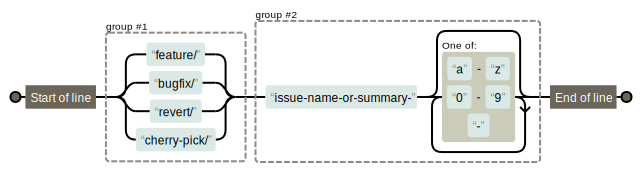

# GitHub
1. リポジトリは右上のGitHubアイコンをクリックする

## 概要 {#overview}
1. コンテンツの管理、IssueなどすべてをGitHubで行う

## ブランチ命名ルール {#branch-naming}
1. 基本はケバブケース(例: `feature/abc-def`)
1. [`^(feature\/|bugfix\/|revert\/|cherry-pick\/)(issue-name-or-summary-[a-z0-9\-]*)$`](https://regexper.com/#%5E%28feature%5C%2F%7Cbugfix%5C%2F%7Crevert%5C%2F%7Ccherry-pick%5C%2F%29%28issue-name-or-summary-%5Ba-z0-9%5C-%5D*%29%24)
    1. 
1. 例
    1. `feature/issue123-frontend-add-lgoin`
    1. `feature/issue333-website-update-docusaurus-3-0-1`

### `feature/`
1. 以下を除くすべて

### `bugfix/`
1. バグ発生時の対応時に使用する
1. ここでのバグは`main`へmerge後に発生したものを指す
    1. テスト中の発生したものは含まない

### `revert/`
1. revert時

### `cherry-pick/`
1. cherry-pick利用時
