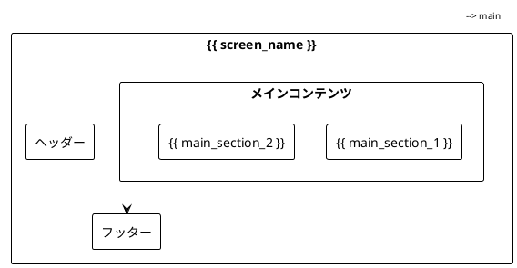

# {{ title }}

## 概要

{{ description }}

## 画面情報

- **画面ID**: {{ screen_id }}
- **画面名**: {{ screen_name }}
- **URL**: {{ url }}
- **アクセス権限**: {{ access_permission }}

## 画面レイアウト

### ワイヤーフレーム



### UI要素

| 要素名 | 種類 | 必須 | 説明 |
|--------|------|------|------|
| {{ element_1 }} | {{ type_1 }} | {{ required_1 }} | {{ desc_1 }} |
| {{ element_2 }} | {{ type_2 }} | {{ required_2 }} | {{ desc_2 }} |

## 機能仕様

### 基本操作

1. **{{ operation_1 }}**
   - 操作手順: {{ steps_1 }}
   - 結果: {{ result_1 }}

2. **{{ operation_2 }}**
   - 操作手順: {{ steps_2 }}
   - 結果: {{ result_2 }}

### バリデーション

| 項目 | バリデーションルール | エラーメッセージ |
|------|---------------------|------------------|
| {{ field_1 }} | {{ rule_1 }} | {{ error_1 }} |
| {{ field_2 }} | {{ rule_2 }} | {{ error_2 }} |

## 画面遷移

```plantuml
@startuml
!theme plain
skinparam backgroundColor white

[*] --> {{ screen_name }}
{{ screen_name }} --> {{ next_screen_1 }} : {{ action_1 }}
{{ screen_name }} --> {{ next_screen_2 }} : {{ action_2 }}
{{ next_screen_1 }} --> [*]
{{ next_screen_2 }} --> [*]
@enduml
```

## データ仕様

### 入力データ

| 項目名 | データ型 | 桁数 | 必須 | 初期値 |
|--------|----------|------|------|--------|
| {{ input_1 }} | {{ type_1 }} | {{ length_1 }} | {{ req_1 }} | {{ default_1 }} |
| {{ input_2 }} | {{ type_2 }} | {{ length_2 }} | {{ req_2 }} | {{ default_2 }} |

### 出力データ

| 項目名 | データ型 | 説明 |
|--------|----------|------|
| {{ output_1 }} | {{ out_type_1 }} | {{ out_desc_1 }} |
| {{ output_2 }} | {{ out_type_2 }} | {{ out_desc_2 }} |

## 関連文書

- [関連画面](./{{ related_screen }}.mdx)
- [データベース仕様](../tables/{{ related_table }}.mdx)
- [API仕様](../../03-external/{{ related_api }}.mdx)

## 変更履歴

| 日付 | バージョン | 変更内容 | 変更者 |
|------|------------|----------|--------|
| {{ date }} | 1.0 | 初版作成 | {{ author }} |